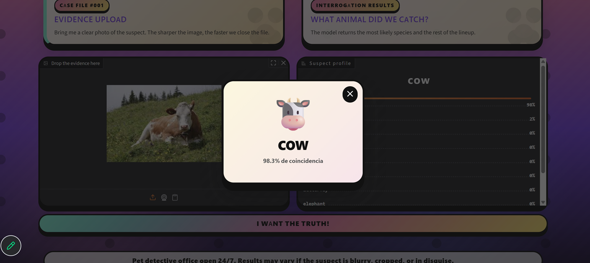
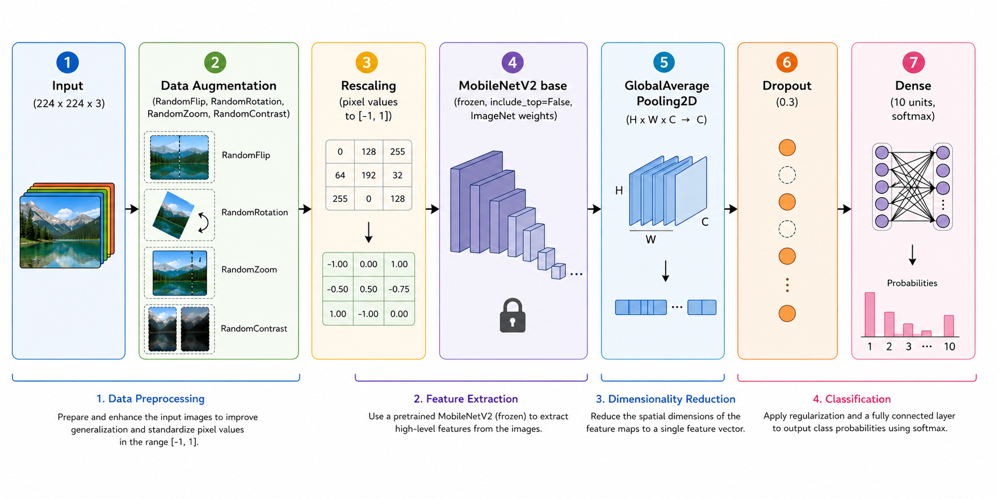

### AI Ventura
## About
- AI Ventura is a CNN-type neural network trained using the Animals10 model to classify 10 animal species (“dog,” “horse,” “elephant,” “butterfly,” “chicken,” “cat,” “cow,” “sheep,” “squirrel,” “spider”) using transfer learning on top of MobileNetV2.
## Usage and Examples
 
- APP on HuggingFace Space -> [AI_ventura](https://huggingface.co/spaces/Bitnick42/AI_ventura)

## Problem statement
* **Task**: Multi-class image classification (10 classes)
* **Goal**: Given a photo of an animal, predict which of the 10 species it belongs to
* **Approach**: Fine-tune a pretrained MobileNetV2 backbone (ImageNet weights) with a custom classification head, using data augmentation and class weighting to handle class imbalance

## Dataset
- **Source:** [Animals-10](https://www.kaggle.com/datasets/alessiocorrado99/animals10) (Kaggle)
- **Classes (10):** butterfly, cat, chicken, cow, dog, elephant, horse, sheep, spider, squirrel
- **Size:** 26,179 images total (after removing 0 unreadable/corrupt files)
- **Split:** 80% train / 10% validation / 10% test, stratified by class
  - Train: 20,943 images
  - Validation: 2,618 images
  - Test: 2,618 images
- **Class balance:** Imbalanced (e.g. dog ~18.6%, spider ~18.4% vs. elephant ~5.5%) balanced using class weights
- **License:** [GPL2](https://www.gnu.org/licenses/old-licenses/gpl-2.0.en.html)

## Model architecture



- **Optimizer:** Adam (learning_rate: 0.001)
- **Loss:** Sparse categorical crossentropy
- **Callbacks:** EarlyStopping (patience 5), ReduceLROnPlateau (factor 0.5, patience 2)

Results – accuracy/loss metrics, confusion matrix, sample outputs
## Setup & installation

| Dependency | Version |
| :--- | :---: |
| keras | ^3.15.0 |
| matplotlib | ^3.10.6 |
| tensorflow | ^2.21.0 |
| numpy | ^2.4.4 |
| pillow | ^12.1.1 |

- **Download repository**: `git clone https://github.com/alfongccode/project-1-brief-CNN.git`
- **Environment setup**:
    - Download animals10 file on your sample_data folder
    - Unzip animal10 file on sample_data folder
    - Run main.ipynb notebook

## Project structure

```
├── assets
|   └── img
|       └── test # test images
|       └── screenshots # screenshots example images
|       └── schema.png # architecture schema
├── main.ipynb
├── requirements.txt
├── README.md
└── sample_data/
    └── animals10/
        └── raw-img/
            ├── butterfly/
            ├── cat/
            ├── chicken/
            ├── cow/
            ├── dog/
            ├── elephant/
            ├── horse/
            ├── sheep/
            ├── spider/
            └── squirrel/
``` 

## Tech stack
- **Language:** Python 3.13
- **Deep Learning:** TensorFlow / Keras (MobileNetV2 pretrained on ImageNet)
- **Data processing:** NumPy, Pillow (PIL)
- **Machine Learning utilities:** scikit-learn (train/test split, class weights, metrics)
- **Visualization:** Matplotlib
- **Environment:** Jupyter Notebook 

## Authors
  - **Nicolas Mooney** - [https://github.com/NIKK014](https://github.com/NIKK014)
  - **Alfonso García Cortijo** - [https://github.com/alfongccode](https://github.com/alfongccode)